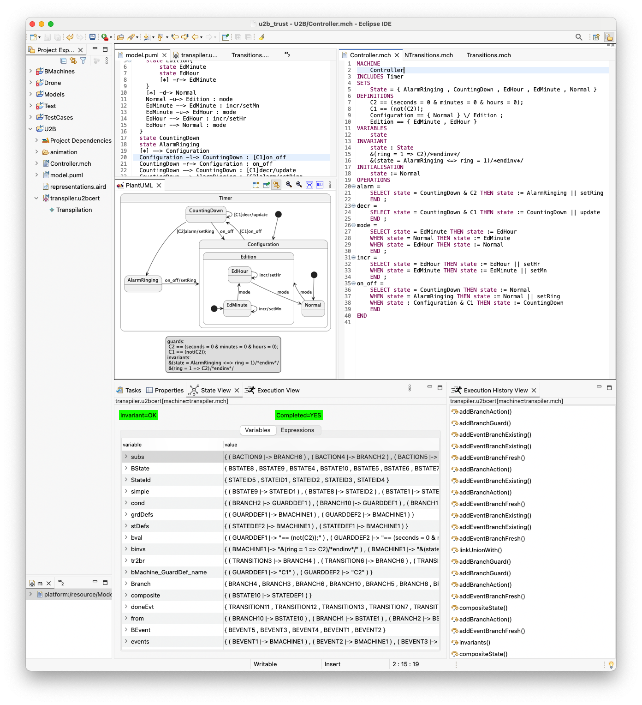

# u2bcert

## UML-to-B Transpilation (U2Bcert)

This repository contains the formally verified UML-to-B transpiler developed
within the **U2Bcert** project. The transpiler takes UML state-transition
diagrams as input and generates a corresponding B machine, together with
proof obligations that are fully discharged using Atelier B.

The screenshot below illustrates:
- the source UML state machine,
- the generated B machine,
- and the successful execution and invariant preservation during simulation.

